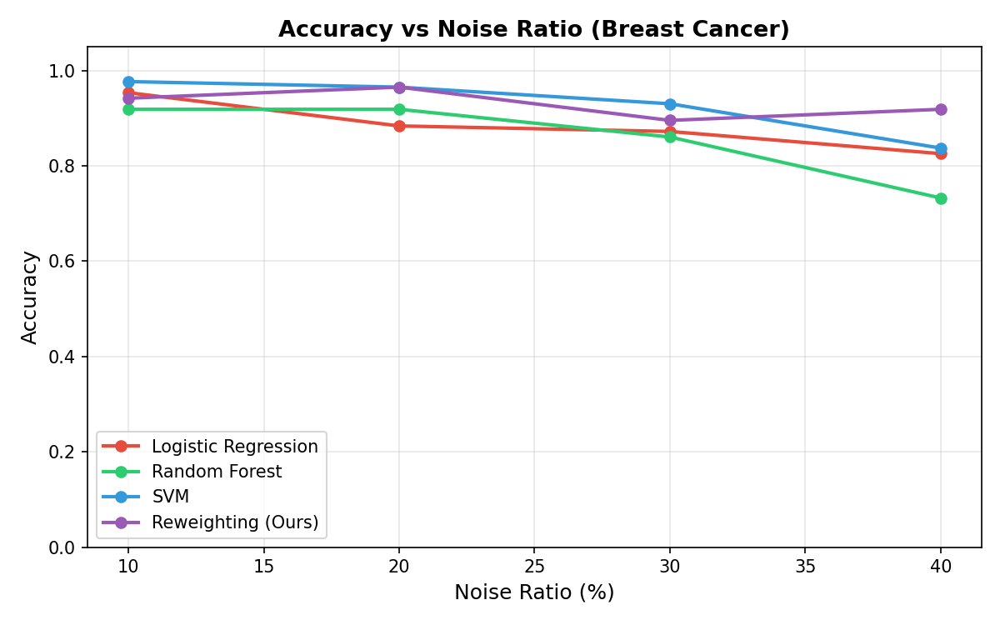
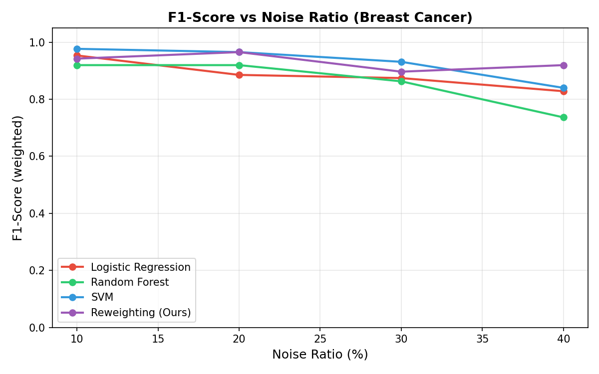
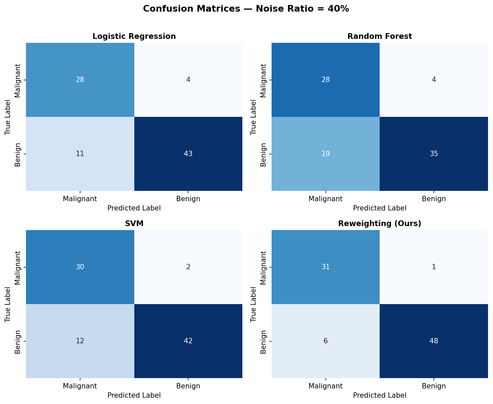
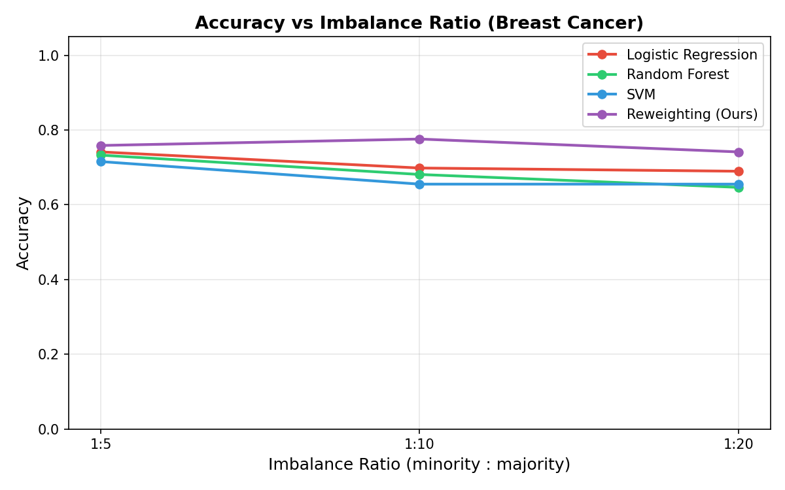
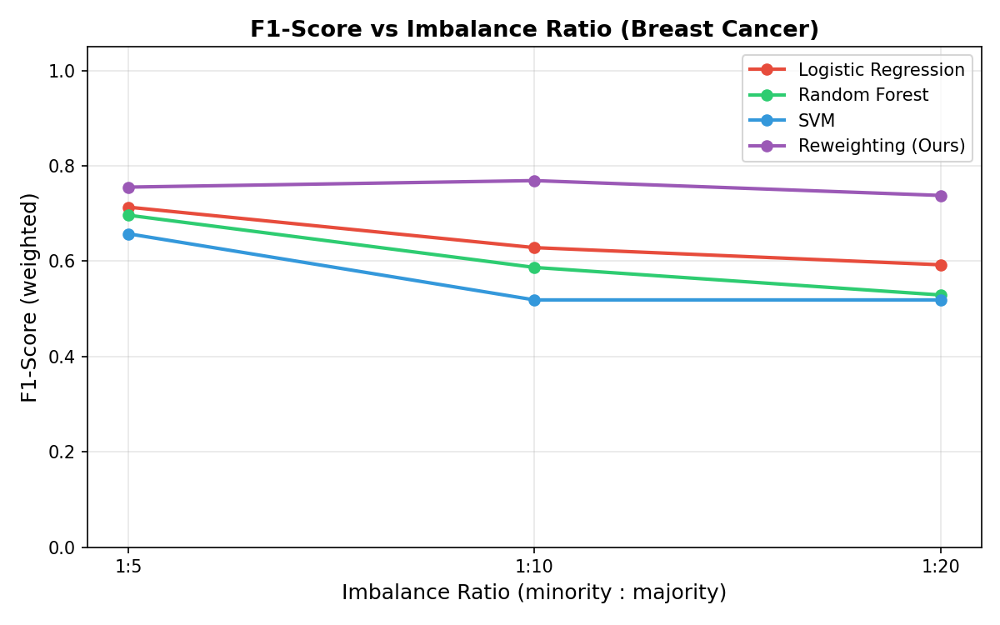
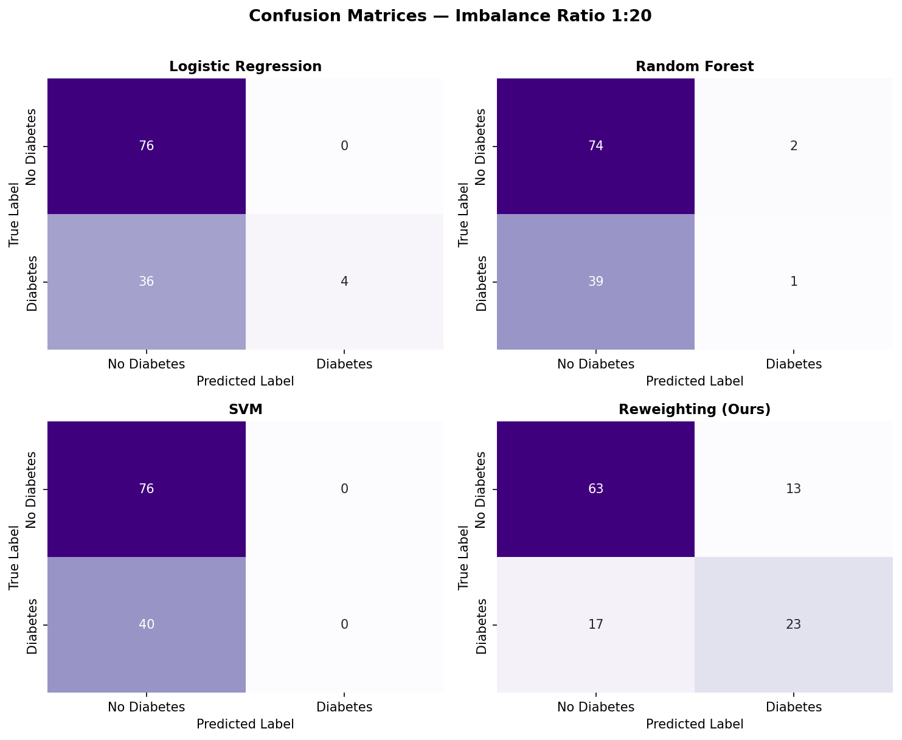

# Report: Learning to Reweight Examples for Robust Deep Learning

[](https://www.python.org/)
[](https://pytorch.org/)
[](https://scikit-learn.org/)
[](LICENSE)

---

## Table of Contents

- [Overview](#overview)
- [The Algorithm](#the-algorithm)
- [Datasets](#datasets)
- [Installation](#installation)
- [Usage](#usage)
- [Results](#results)
- [References](#references)

---

## Overview

Deep neural networks are vulnerable to two common training set biases:

| Problem | What happens |
|---------|-------------|
| **Label Noise** | Randomly flipped or incorrect annotations cause the model to memorise wrong labels |
| **Class Imbalance** | Minority-class samples contribute negligibly to the gradient, causing the model to ignore them |

Classical reweighting methods give contradictory signals — hard negative mining raises weights on high-loss samples (good for imbalance, bad for noise), while noise-robust methods do the opposite. Neither is universally safe.

**This project implements a simplified version of the meta-learning reweighting algorithm by Ren et al. (ICML 2018)**, which solves both problems with a single principled mechanism: use a small, clean validation set to dynamically assign importance weights to every training example at each iteration, guided by gradient alignment rather than loss magnitude.

The method is compared against three standard baselines — **Logistic Regression**, **Random Forest**, and **SVM** — on two UCI datasets.

---

## The Algorithm

The core idea is to assign each training sample a weight $w_i$ that reflects how helpful it is for reducing the clean validation loss.

### Intuition

At every training step:
1. Compute the **validation gradient** — the direction that would improve the clean validation loss.
2. For each training sample, compute its **training gradient**.
3. If a sample's gradient **aligns** with the validation gradient → it is helpful → give it a **higher weight**.
4. If a sample's gradient **opposes** the validation gradient → it is harmful (likely noisy or misleading) → give it a **lower weight** (or zero).

$$w_i \propto \max\!\bigl(\langle \nabla_\theta \mathcal{L}_{\text{val}},\; \nabla_\theta \mathcal{L}_i \rangle,\; 0\bigr)$$

Weights are normalised to sum to 1 and used to compute the final weighted training loss for that step.

---

## Datasets

Two separate datasets from the [UCI ML Repository](https://archive.ics.uci.edu/datasets) are used — one per experiment.

### Dataset 1 — Breast Cancer Wisconsin (Experiment 1: Noisy Labels)

| Property | Value |
|----------|-------|
| **UCI ID** | [17](https://archive.ics.uci.edu/dataset/17/breast+cancer+wisconsin+diagnostic) |
| **Samples** | 569 |
| **Features** | 30 (real-valued nuclear measurements from FNA biopsies) |
| **Classes** | Malignant (212) · Benign (357) |
| **Split** | Train: 397 · Val: 86 · Test: 86 |
| **Source** | `sklearn.datasets.load_breast_cancer()` — no download needed |

**Why suitable:** High-quality, well-studied labels that can be safely corrupted synthetically. The 30 features provide rich gradient information for the reweighting algorithm.

### Dataset 2 — Pima Indians Diabetes (Experiment 2: Class Imbalance)

| Property | Value |
|----------|-------|
| **UCI ID** | [34](https://archive.ics.uci.edu/dataset/34/diabetes) |
| **Samples** | 768 |
| **Features** | 8 (glucose, BMI, age, insulin, etc.) |
| **Classes** | No Diabetes (500, 65.1%) · Diabetes (268, 34.9%) |
| **Split** | Train: 536 · Val: 116 · Test: 116 |
| **Source** | Auto-downloaded via `sklearn.datasets.fetch_openml()` and cached locally |

**Why suitable:** Natural moderate imbalance (~2:1) that can be exaggerated to 1:5, 1:10, and 1:20 to stress-test robustness under severe minority-class under-representation.

---

## Installation

### 1. Clone the repository

```bash
git clone https://github.com/<your-username>/<your-repo-name>.git
cd "<your-repo-name>"
```

### 2. (Recommended) Create a virtual environment

```bash
python3 -m venv venv
source venv/bin/activate        # Linux / macOS
# venv\Scripts\activate         # Windows
```

### 3. Install dependencies

```bash
pip install -r requirements.txt
```

**Requirements:**

```
torch>=2.0.0
scikit-learn>=1.3.0
numpy>=1.24.0
pandas>=2.0.0
matplotlib>=3.7.0
seaborn>=0.12.0
```
---

## Usage

### Run both experiments

```bash
python3 train.py
```

This trains all four models under all experimental conditions and saves plots and result tables automatically.

### Run a single experiment

```bash
python3 train.py --exp noisy        # Experiment 1 only (noisy labels)
python3 train.py --exp imbalance    # Experiment 2 only (class imbalance)
```

### Customise training settings

```bash
python3 train.py --epochs 30 --batch_size 32 --seed 123
```

| Flag | Default | Description |
|------|---------|-------------|
| `--exp` | `both` | Which experiment to run (`noisy` / `imbalance` / `both`) |
| `--epochs` | `50` | Training epochs for the reweighting model |
| `--batch_size` | `64` | Mini-batch size |
| `--val_batch` | `32` | Validation mini-batch size used per step |
| `--seed` | `42` | Global random seed |

### Generate evaluation report and bar charts

```bash
python3 evaluate.py
```

### Outputs

After running:

```
plots/
  noisy_accuracy_vs_noise.png        
  noisy_f1_vs_noise.png              
  noisy_training_loss_10pct.png
  noisy_training_loss_20pct.png          
  noisy_training_loss_30pct.png          
  noisy_training_loss_40pct.png             
  noisy_confusion_matrices_40pct.png  
  imbalance_accuracy_vs_ratio.png    
  imbalance_f1_vs_ratio.png          
  imbalance_training_loss_1_5.png
  imbalance_training_loss_1_10.png      
  imbalance_training_loss_1_20.png           
  imbalance_confusion_matrices_1_20.png  
  eval_noisy_f1_bar.png
  eval_noisy_accuracy_bar.png                                
  eval_imbalance_f1_bar.png
  eval_imbalance_accuracy_bar.png

results/
  noisy_labels_results.csv
  noisy_labels_results.json
  imbalance_results.csv
  imbalance_results.json
```

---

## Results

### Experiment 1 — Noisy Labels (Breast Cancer Wisconsin)

<p float="left">
  
  
</p>

Noise is applied to training labels only. Models are evaluated on the clean test set.

| Noise Ratio | LR (Acc) | LR (F1) | RF (Acc) | RF (F1) | SVM (Acc) | SVM (F1) | Reweighting (Acc) | Reweighting (F1) |
| :---: | :---: | :---: | :---: | :---: | :---: | :---: | :---: | :---: |
| 10% | 0.9535 | 0.9535 | 0.9186 | 0.9196 | **0.9767** | **0.9767** | 0.9419 | 0.9423 |
| 20% | 0.8837 | 0.8853 | 0.9186 | 0.9196 | **0.9651** | **0.9652** | **0.9651** | **0.9652** |
| 30% | 0.8721 | 0.8742 | 0.8605 | 0.8628 | **0.9302** | **0.9312** | 0.8953 | 0.8966 |
| 40% | 0.8256 | 0.8281 | 0.7326 | 0.7364 | 0.8372 | 0.8399 | **0.9186** | **0.9196** |




### Experiment 2 — Class Imbalance (Pima Indians Diabetes)

<p float="left">
  
  
</p>

The minority class (diabetes) is subsampled in the training set only. Validation and test sets stay balanced.

| Imbalance Ratio | LR (Acc) | LR (F1) | RF (Acc) | RF (F1) | SVM (Acc) | SVM (F1) | Reweighting (Acc) | Reweighting (F1) |
| :---: | :---: | :---: | :---: | :---: | :---: | :---: | :---: | :---: |
| 1:5 | 0.7414 | 0.7133 | 0.7328 | 0.6964 | 0.7155 | 0.6574 | **0.7586** | **0.7554** |
| 1:10 | 0.6983 | 0.6284 | 0.6810 | 0.5868 | 0.6552 | 0.5187 | **0.7759** | **0.7690** |
| 1:20 | 0.6897 | 0.5924 | 0.6466 | 0.5291 | 0.6552 | 0.5187 | **0.7414** | **0.7379** |



---

## References

1. **Ren, M., Zeng, W., Yang, B., & Urtasun, R.** (2018). Learning to reweight examples for robust deep learning. *ICML 2018*. [[Paper]](https://arxiv.org/abs/1803.09050) [[Original Code]](https://github.com/uber-research/learning-to-reweight-examples)

2. **Zhang, C., Bengio, S., Hardt, M., Recht, B., & Vinyals, O.** (2017). Understanding deep learning requires rethinking generalization. *ICLR 2017*.

3. **Wolberg, W. H.** et al. (1994). Breast Cancer Wisconsin (Diagnostic) dataset. *UCI ML Repository, ID 17*. [[Link]](https://archive.ics.uci.edu/dataset/17/breast+cancer+wisconsin+diagnostic)

4. **Smith, J. W.** et al. (1988). Pima Indians Diabetes dataset. *UCI ML Repository, ID 34*. [[Link]](https://archive.ics.uci.edu/dataset/34/diabetes)

5. **Pedregosa, F.** et al. (2011). Scikit-learn: Machine learning in Python. *JMLR, 12*, 2825–2830.

6. **Paszke, A.** et al. (2019). PyTorch: An imperative style, high-performance deep learning library. *NeurIPS 2019*.

---
